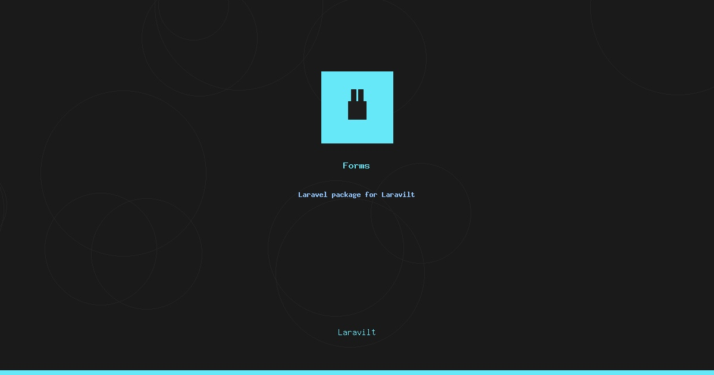

# Laravilt Forms

[](https://packagist.org/packages/laravilt/forms)
[](https://packagist.org/packages/laravilt/forms)
[](https://packagist.org/packages/laravilt/forms)
[](https://github.com/laravilt/forms/actions/workflows/dependabot/dependabot-updates)
[](https://github.com/laravilt/forms/actions/workflows/fix-php-code-styling.yml)
[](https://github.com/laravilt/forms/actions/workflows/tests.yml)

Complete form builder system with 30+ field types, validation, and Blade/Inertia.js integration for Laravilt. Build complex forms with text inputs, selects, date pickers, file uploads, rich editors, repeaters, and more.

## Features

- 📝 **30+ Field Types** - TextInput, Select, DatePicker, FileUpload, RichEditor, Repeater, and more
- ✅ **Validation** - Built-in Laravel validation integration
- 🎨 **Blade Components** - Pre-built UI components with Reka UI styling
- ⚡ **Inertia Integration** - Seamless Vue 3 form handling
- 🔄 **Real-time Reactivity** - Dynamic field visibility, options, and validation
- 📁 **File Management** - Advanced file upload with preview and validation
- 📝 **Rich Content** - WYSIWYG editor, Markdown editor, code editor support

## Installation

```bash
composer require laravilt/forms
```

## Quick Start

```php
use Laravilt\Forms\Components\TextInput;
use Laravilt\Forms\Components\Select;

$form->schema([
    TextInput::make('name')
        ->label('Full Name')
        ->required(),

    Select::make('role')
        ->label('Role')
        ->options([
            'admin' => 'Administrator',
            'editor' => 'Editor',
        ])
        ->required(),
]);
```

## Generator Commands

```bash
# Generate a form class
php artisan make:form UserForm

# Generate a resource form with CRUD operations
php artisan make:form UserForm --resource

# Generate a custom field component
php artisan make:component CustomField
```

## Documentation

- **[Complete Documentation](docs/index.md)** - All field types, validation, and examples
- **[MCP Server Guide](docs/mcp-server.md)** - AI agent integration

## Field Types

**Basic:** TextInput, Textarea, NumberField, Select, Checkbox, CheckboxList, Radio, Toggle, ToggleButtons, Hidden

**Date & Time:** DatePicker, DateTimePicker, TimePicker, DateRangePicker

**Advanced:** ColorPicker, IconPicker, FileUpload, RichEditor, MarkdownEditor, CodeEditor, TagsInput, KeyValue, Slider, RateInput, PinInput

**Dynamic:** Repeater, Builder

## Configuration

```bash
php artisan vendor:publish --tag="laravilt-forms-config"
php artisan vendor:publish --tag="laravilt-forms-views"
php artisan vendor:publish --tag="laravilt-forms-assets"
```

## Testing

```bash
composer test
```

## License

The MIT License (MIT). Please see [License File](LICENSE.md) for more information.
